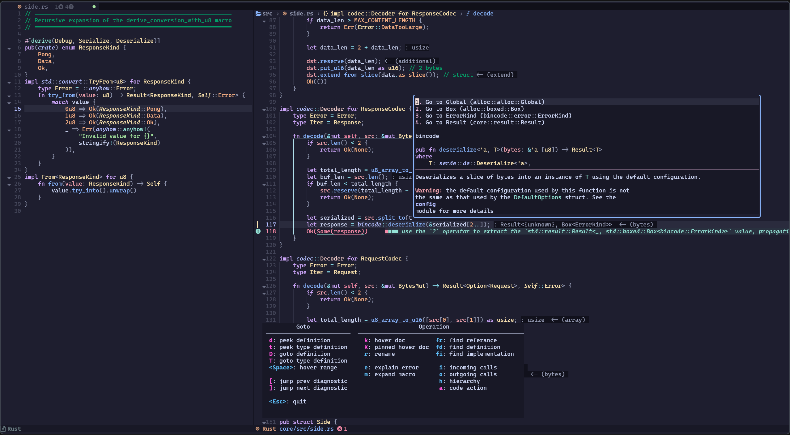

# My Neovim Configs

## ✨ Features

- 🚀 Blazingly fast.
- 💤 Easily add plugins with [lazy.nvim](https://github.com/folke/lazy.nvim)

## ⚡️Requirements

Require Neovim >= v0.10.0
A c complier for `treesitter`

## [Keymap](./KEYMAP.md "Plugins")

## File structure

- `core`
  - `autocmd`: Set auto commands
  - `neovide`: Neovide-specific options
  - `vscode`: VSCode-specific options
  - `options`: basic options
  - `lazy`: load plugins
  - `utils`: utility functions
- `plugins`
  - `theme`: theme
  - `dashboard`: Welcome screen
  - `ui`: Modify Neovim built-in UI
  - `qol`: Some improvement
  - `editing`: Editing utilities
  - `editor`: Add new features which usually interact with a custom window
  - `statusline`: statusline
  - `lsp`: Language Server Protocol
  - `mini`: [Mini series plugins](https://github.com/echasnovski/mini.nvim)
  - `cmp`: Auto-completion
  - `hydra`: Custom submodes and menus (like Emacs hydra)
  - `dap`: Debug Adapter Protocol
